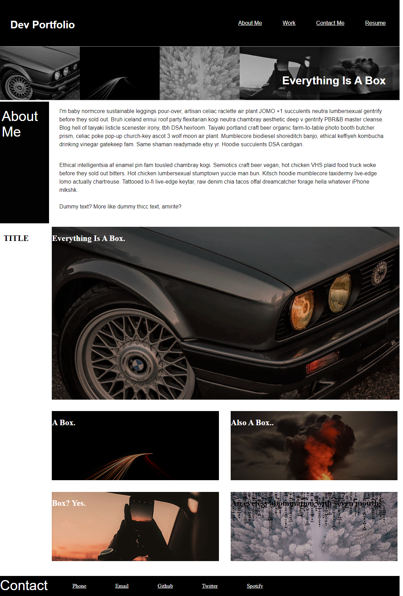

# <Personal-Dev-Portfolio>

## Description

I've created a personal dev portfolio in order to showcase and keep track of my work and progress. This webpage was created from scratch starting with a wireframe and details were added afterwards.

Creating this helped highlight my strengths and weaknesses in order for me to determine what topics I will need to study more in depth.

## Usage

This web application hosts a personal dev portfolio.

https://melona-png.github.io/personal-dev-portfolio/
